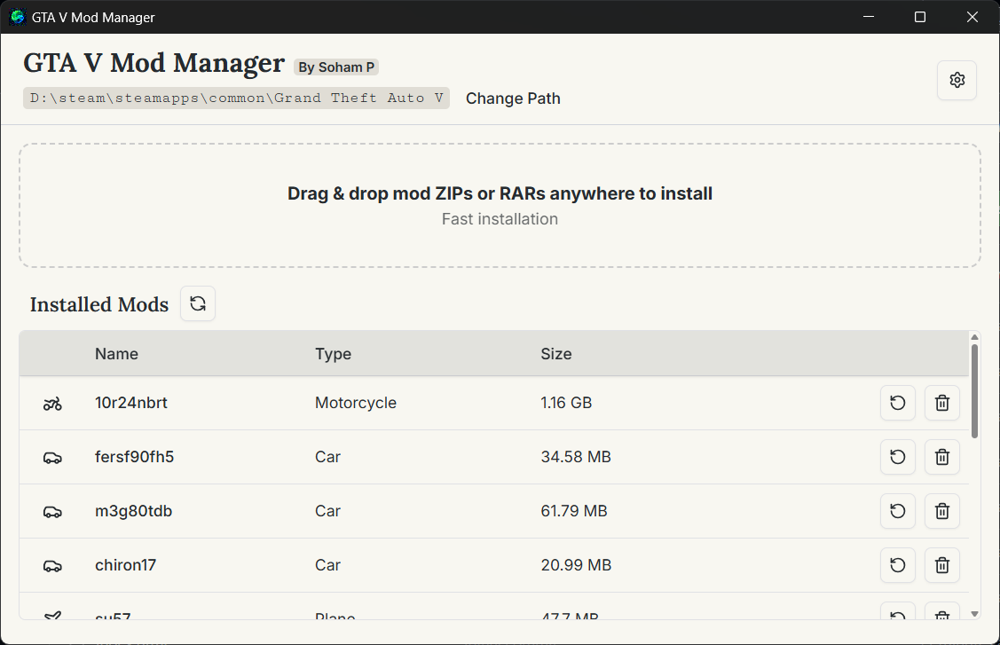
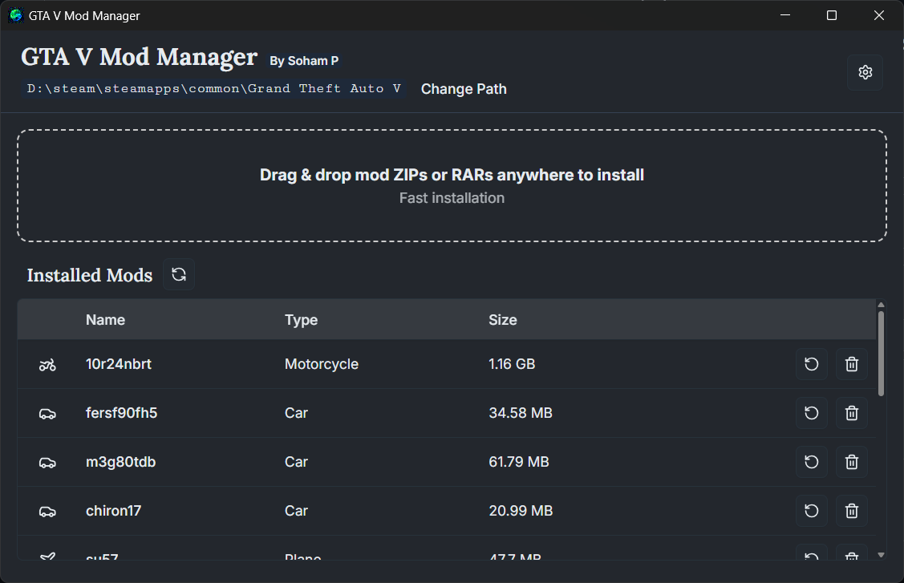
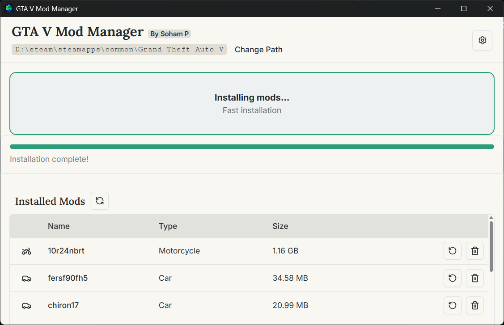
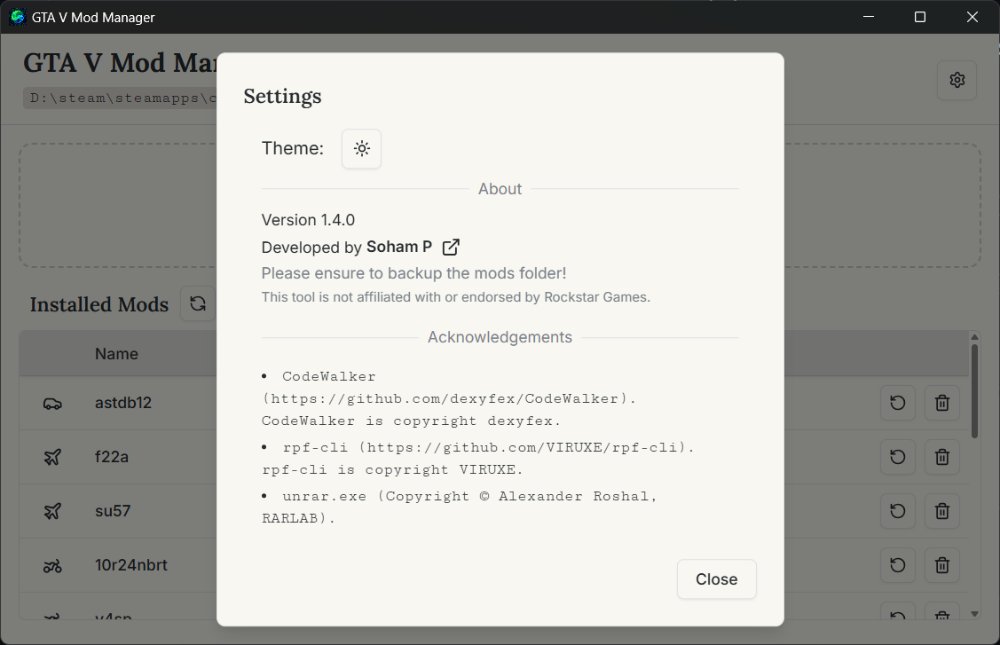

# GTA V Mod Manager

A modern desktop mod manager for Grand Theft Auto V, built with Tauri (Rust backend) and React (frontend).  
Designed for super-fast, in-place mod installs with a clean and responsive UI—no more tedious RPF repacking!

## Screenshots

<table>
  <tr>
    <td align="center">
      
    </td>
    <td align="center">
      
    </td>
  </tr>
  <tr>
    <td align="center">
      
    </td>
    <td align="center">
      
    </td>
  </tr>
</table>

---

## Features

- **Drag-and-Drop Mod Installation:** Add ZIP/RAR add-on mods just by dragging them into the app window.
- **Lightning Fast RPF Patching:** Instantly updates `update.rpf` and `dlclist.xml` using CodeWalkerCLI, with no slow full repack.
- **Automatic Mod Folder Management:** Copies mods to your `mods/update/x64/dlcpacks` directory and organizes them.
- **Auto dlclist.xml Handling:** Detects, patches, and writes the correct entry into your `dlclist.xml` after installation.
- **Smooth Tauri UI:** All heavy operations run off the main thread for a responsive, never-blocking user experience.
- **100% Free and Open Source:** No telemetry or unnecessary background processes.

---

## Quickstart

### Prerequisites

- GTA V installed (with OpenIV or mod-friendly setup: `update.rpf` in `mods` folder)
- [Node.js](https://nodejs.org/en/) and [pnpm](https://pnpm.io/) (or npm/yarn)
- [Rust + Tauri prerequisites](https://tauri.app/v2/guides/getting-started/prerequisites/)
- Place `rpf.exe`, `CodeWalkerCLI.exe`, and `UnRAR.exe` into `src-tauri/bin/`
- .NET 8.0 Runtime (required for CodeWalkerCLI)

### Setup

```
git clone https://github.com/sohamparanjape12/gta-v-mod-manager.git
cd gta-v-mod-manager
pnpm install # or npm install/yarn
pnpm tauri dev # or npm run tauri dev
```


---

## How It Works

- **1.** Auto-detect or manually select your GTA V install directory
- **2.** Drag any add-on car/map/pack ZIP or RAR file into the window
- **3.** Confirm and watch progress as the mod is copied, and RPF and XML are patched in-place
- **4.** Launch GTA V! Your new content is now enabled

---

## Roadmap and Goals

- Cross-platform support for macOS and Linux
- Automatic backups of modified files before install
- Community-powered mod info database

---

## Contributing

Issues, feature requests, and PRs are welcome!  
File a GitHub issue or open a pull request to help make GTA V modding better.

## License

MIT License

---

> Fast, safe, and user-friendly GTA V modding for everyone.  
> Made with ❤️ by Soham Paranjape and contributors.
